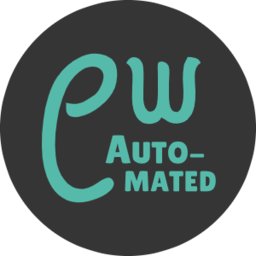

# Home Assistant Add-on: Calibre-Web Automated




## About

[Calibre-Web Automated](https://github.com/crocodilestick/Calibre-Web-Automated) extends
the popular Calibre-Web interface with automated ebook ingestion, metadata fetching, and
library management.

Drop an ebook into the ingest folder — CWA automatically imports it into your Calibre
library, fetches metadata, and removes it from the ingest folder. Browse and read your
library through the built-in web UI, accessible directly from the HA sidebar via Ingress.

## Installation

1. Add this repository to your Home Assistant instance:

   [](https://my.home-assistant.io/redirect/supervisor_add_addon_repository/?repository_url=https%3A%2F%2Fgithub.com%2Fkoraysels%2Fhassio-addons)

   Or go to **Settings → Add-ons → Add-on Store → ⋮ → Repositories** and add:
   ```
   https://github.com/koraysels/hassio-addons
   ```

2. Find **Calibre-Web Automated** in the store and click **Install**
3. Review the **Configuration** tab and adjust paths if needed
4. Click **Start**
5. Check the **Log** tab to confirm startup completed successfully
6. Open the Web UI via the **Open Web UI** button or the sidebar panel

## First-time setup

1. Log in with the default credentials: **admin / admin123**
2. **Change the password immediately** (top-right menu → Admin → Edit User)
3. Go to **Admin → Edit Basic Configuration** and set the Calibre library location to `/calibre-library`
4. Save — your library is ready

## Configuration

| Option | Default | Description |
|--------|---------|-------------|
| `books_dir` | `/share/calibre/books` | Calibre library folder. Must contain `metadata.db` (created on first run). |
| `ingest_dir` | `/share/calibre/ingest` | Drop new ebooks here. Files are imported and removed automatically. |
| `config_dir` | `/share/calibre/config` | App configuration, SQLite database, and logs. |
| `PUID` | `1000` | Unix user ID the app runs as. Run `id` in a terminal to find yours. |
| `PGID` | `1000` | Unix group ID the app runs as. |
| `TZ` | `UTC` | IANA timezone string, e.g. `Europe/Amsterdam`. |

All data lives under `/share/calibre/` and persists across restarts and updates.

## Network access

| Method | URL |
|--------|-----|
| HA Ingress (recommended) | Sidebar panel — no port forwarding needed |
| Direct | `http://<ha-ip>:8083` |

## Notes

- The ingest folder is **destructive by design** — ebooks are moved into the library, not copied
- To migrate an existing Calibre library, point `books_dir` at the folder containing your `metadata.db`
- `armv7` support depends on the upstream CWA image; `amd64` and `aarch64` are fully tested
- Upstream project: [crocodilestick/Calibre-Web-Automated](https://github.com/crocodilestick/Calibre-Web-Automated)
